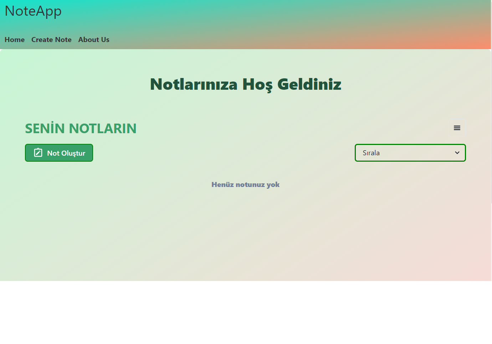
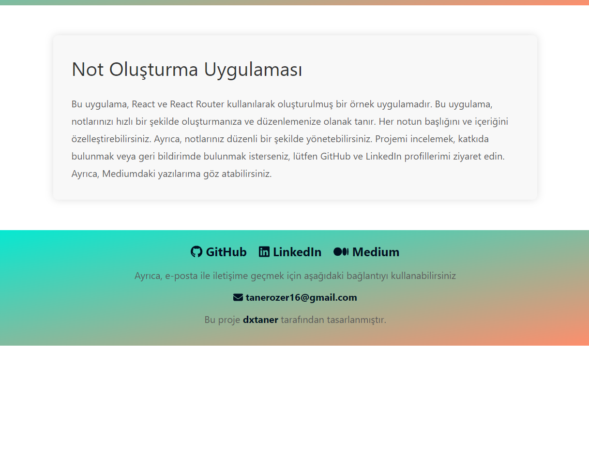
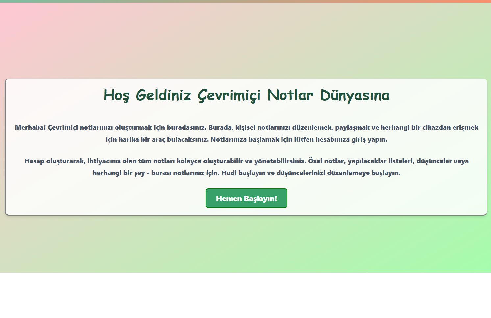
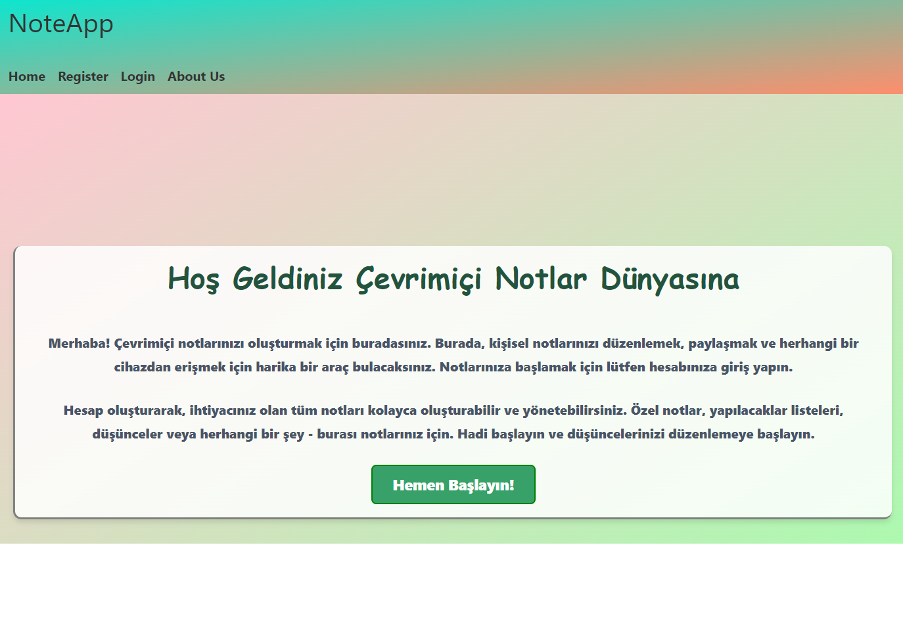
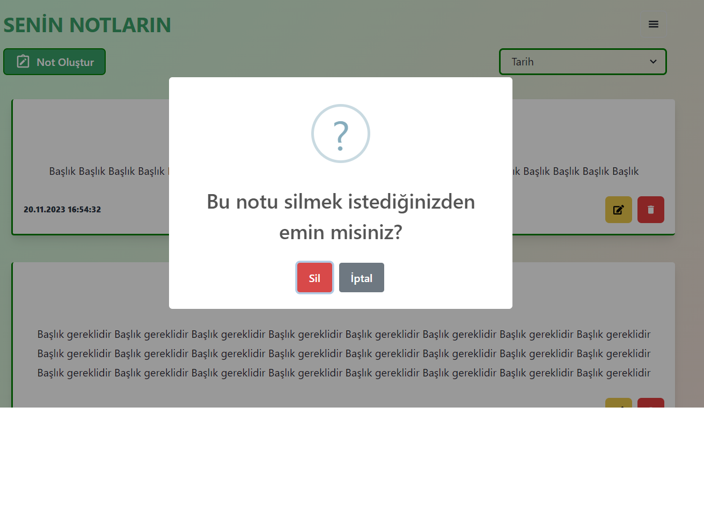

# Notes App

This directory contains screenshots of the Notes App, showcasing various features and functionalities.

## Screenshots

### Home Page

The home page of the Notes App displays a list of notes along with options for creating, editing, and deleting notes.

 

### About Us Page

The about us page provides information about the creators or developers of the Notes App.

### Welcome Page

The welcome page greets users and provides a brief introduction to the Notes App.

 

### Registration/Login

The registration/login page allows users to create a new account or login to an existing account.

### Adding Note

This screenshot demonstrates the process of adding a new note to the app.

### Creating Note

The creating note page allows users to input the content for a new note.

### Notes Update

This screenshot showcases the functionality of updating an existing note.

### Note Deletion

This screenshot illustrates the process of deleting a note from the app.

### Invalid Login

When users enter incorrect credentials, they encounter an invalid login message.

### Successful Login

Upon successful login, users are redirected to the home page of the Notes App.

### Footer

The footer section of the Notes App provides additional information or links.

### Others

For additional screenshots, please refer to the [NotesAppScreenShots](NotesAppScreenShots) directory.
